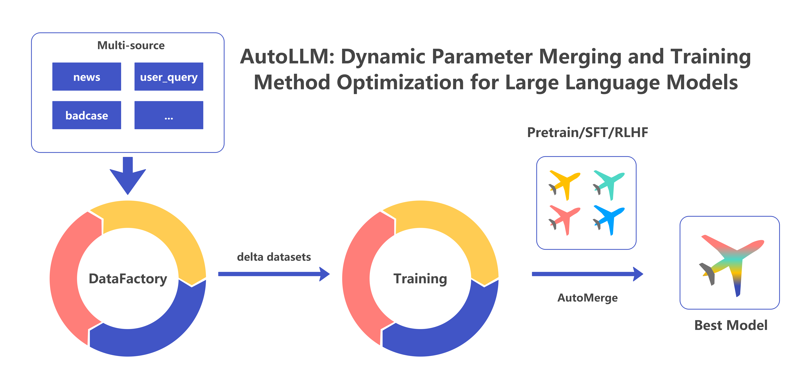

# AutoLLM
AutoLLM is a tool designed for the automated updating of model parameters through the merging of different data and training method parameters. We believe the key to intelligent models lies in continuous learning and updating. By generating new data and combining various training methods (e.g., pretrain, supervised fine-tuning (SFT), and Reinforcement Learning with Human Feedback (RLHF)), AutoLLM can automatically adjust the mixing ratios of model parameters, thus continually enhancing the intelligent performance in practical applications.



## Main Features and Steps
### Step 1: Data Generation and Segregation
- Generate a batch of data from the source database (data can also be generalized from multiple sources such as user queries, evaluation bad cases, etc.).
- Divide the generated data into multiple small chunks and reserve a portion as the evaluation dataset.

### Step 2: Data Chunk Training
- Use SFT (or other training methods like DPO) to train multiple data chunks separately.
- We believe different datasets should be suited to different training methods; therefore, the appropriate training method or loss function optimization should be chosen based on data characteristics. For instance, SFT is usually used for optimizing expressive styles, while DPO is employed when penalizing negative examples.
- When the optimal training method cannot be determined, we recommend using multiple training methods in parallel. In the subsequent stage, the optimization algorithm will automatically select the necessary delta parameters.

### Step 3: Data Mixing
- Mix the data according to delta parameters. The mixing ratio and training strategy choices are automatically determined by the optimization algorithm, aiming to optimize the score on the evaluation dataset.

## Usage Instructions
This project relies on LLaMA-Factory for model fine-tuning. Please download the code into the current folder and install the necessary dependencies:
```shell
cd AutoLLM
rm -rf LLaMA-Factory
git clone --depth 1 https://github.com/hiyouga/LLaMA-Factory.git
cd LLaMA-Factory
pip install -e .
pip install bayesian-optimization
cd ..
```

The sample script constructs a toy example using mock data. Users can modify and use it as per their needs. To run the script with one command:
```shell
cd AutoLLM
sh autollm.sh
```

## Experimental Results
We report the experimental results of using llama3-8b on four predefined delta_data sets as follows:
|model|eval_score|
|--|--|
|raw|0.41|
|train@all|**0.46**|
|train@delta_1|0.26|
|train@delta_2|0.31|
|train@delta_3|0.39|
|train@delta_4|0.12|
|average_merge|0.16|
|human_merge|0.51|
|auto_merge|**0.54**|

The types of the four data sets are: Mathematics, Code, Instruction Following, Instruction Generation.

The (optimal) parameters for various merging methods are as follows:
|model|delta_1_weight|delta_2_weight|delta_3_weight|delta_4_weight|
|--|--|--|--|--|
|average_merge|1|1|1|1|
|human_merge|0|0|1|0.2|
|auto_merge|0.11787106318307217|0.5505310957766784|0.4914651404592535|0.14596056082881093|

For more results and analysis, readers are encouraged to conduct their own experiments. Discussions are welcome in the issues section.

## License
The code in this repository is open-sourced under the Apache-2.0 License.