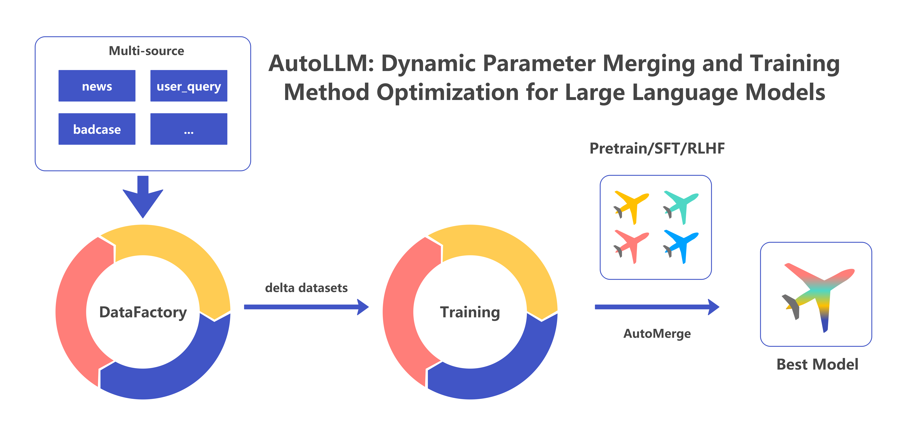

# AutoLLM

AutoLLM 是一个用于自动合并不同数据参数和不同训练方法参数的模型自更新工具。我们相信模型智能的关键在于持续的学习和更新。通过生成新的数据，并结合多种训练方法（如预训练（pretrain）、监督微调（SFT）和基于人类反馈的强化学习（RLHF））获取更新的模型参数，AutoLLM 能够自动调节模型参数混合比例，从而在实际应用场景中不断提升智能效果。



## 主要功能和步骤

### 步骤1: 数据生成和分离
- 从来源数据库中泛化生成一批数据（此外，还可以根据用户query、评测badcase等多来源数据进行泛化）。
- 将生成的数据分为多个小块，并预留一部分作为评测数据集。

### 步骤2: 数据块训练
- 使用 SFT（或 DPO 等其他训练方法）分别对多个数据块进行训练。
- 我们认为，不同的数据集应适用于不同的训练方法，因此需要根据数据特点选择合适的训练方式或优化损失函数。例如，表达风格的优化通常使用 SFT，而需要对负例进行惩罚时则使用 DPO 等等。
- 在无法确定最佳训练方法的情况下，我们建议并行使用多种训练方法，并在进入下一阶段后由优化算法自动选择所需的 delta 参数。

### 步骤3: 数据混合
- 根据 delta 参数对数据进行混合，即通过优化算法自动确定数据混合比例和训练策略选择，以评测数据集上的得分为优化目标。

## 项目使用方法

本项目依赖 LLaMA-Factory 进行模型微调，请将代码下载至当前文件夹下并安装对应的依赖:

```shell
cd AutoLLM
rm -rf LLaMA-Factory
git clone --depth 1 https://github.com/hiyouga/LLaMA-Factory.git
cd LLaMA-Factory
pip install -e .
pip install bayesian-optimization
cd ..
```

样例脚本使用mock数据构建了一个toy example，读者可根据自己的需求进行修改和使用，一键运行脚本：

```shell
cd AutoLLM
sh autollm.sh
```

## 实验结果

我们使用llama3-8b在4份设定的delta_data上的实验结果如下：

|model|eval_score|
|--|--|
|raw|0.41|
|train@all|**0.46**|
|train@delta_1|0.26|
|train@delta_2|0.31|
|train@delta_3|0.39|
|train@delta_4|0.12|
|average_merge|0.16|
|human_merge|0.51|
|auto_merge|**0.54**|

其中4份数据的类型分别是：数学、代码、指令遵循、指令生产

其中几种merge方法的（最优）参数如下：

|model|delta_1_weight|delta_2_weight|delta_3_weight|delta_4_weight|
|--|--|--|--|--|
|average_merge|1|1|1|1|
|human_merge|0|0|1|0.2|
|auto_merge|0.11787106318307217|0.5505310957766784|0.4914651404592535|0.14596056082881093|

更多结果及分析请读者自行实验，欢迎在issues内讨论。

## 协议

本仓库的代码依照 Apache-2.0 协议开源。
